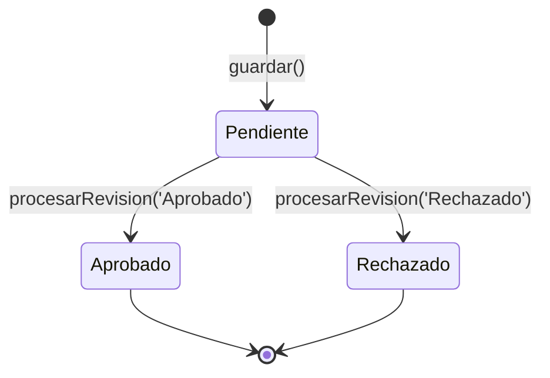

## Overview

The `DevolucionModel` class handles all database operations related to product returns and deviations. It manages the complete lifecycle from initial registration by auxiliary users to review and approval by administrators, and provides statistical data for the dashboard.

**Database Table**: `devoluciones`

**Key Responsibilities**:
- Register new product returns with customer and product information
- Retrieve pending returns for administrative review
- Process approval/rejection decisions with admin codes
- Generate statistics by date and status
- Provide available dates for filtering

---

## Constructor

```php
public function __construct()
```

Initializes the model and establishes database connection using `Conexion::Conectar()`.

---

## Methods

### guardar()

```php
public function guardar($datos)
```

Inserts a new product return record into the `devoluciones` table. This method is used by auxiliary users to register returns, shortages, or overages.

<ParamField path="datos" type="array" required>
  Associative array containing all return information:
  
  <ResponseField name="nit" type="string" required>
    Customer tax identification number
  </ResponseField>
  
  <ResponseField name="nombre_cliente" type="string" required>
    Customer name
  </ResponseField>
  
  <ResponseField name="direccion" type="string" required>
    Customer delivery address
  </ResponseField>
  
  <ResponseField name="item_producto" type="string" required>
    Product item code (references `producto.item`)
  </ResponseField>
  
  <ResponseField name="descripcion_producto" type="string" required>
    Product description
  </ResponseField>
  
  <ResponseField name="unidad" type="string" required>
    Unit of measurement (e.g., "Paquete", "Caja")
  </ResponseField>
  
  <ResponseField name="kg" type="float" required>
    Weight per unit in kilograms
  </ResponseField>
  
  <ResponseField name="motivo" type="string" required>
    Reason code: "Devolucion", "Faltante", or "Sobrante"
  </ResponseField>
  
  <ResponseField name="cantidad_und" type="int" required>
    Quantity in units
  </ResponseField>
  
  <ResponseField name="cantidad_kg" type="float" required>
    Total weight in kilograms
  </ResponseField>
  
  <ResponseField name="observacion" type="string">
    Auxiliary user observations
  </ResponseField>
  
  <ResponseField name="usuario_creador" type="string" required>
    Username of the auxiliary user creating the record
  </ResponseField>
  
  <ResponseField name="evidencia" type="string">
    Base64-encoded image or file path for evidence (optional)
  </ResponseField>
</ParamField>

**Returns**: `bool` - `true` on successful insertion, `false` on failure

**Automatic Fields**:
- `estado` is set to `"Pendiente"` by default
- `fecha_creacion` is set to `NOW()` timestamp

<CodeGroup>
```php SQL Query
INSERT INTO devoluciones (
    nit, nombre_cliente, direccion, item_producto, descripcion_producto, 
    unidad, kg, motivo, cantidad_und, cantidad_kg, 
    observacion, usuario_creador, estado, fecha_creacion, evidencia
) VALUES (?, ?, ?, ?, ?, ?, ?, ?, ?, ?, ?, ?, 'Pendiente', NOW(), ?)
```

```php Usage Example
$model = new DevolucionModel();

$datos = [
    'nit' => '900123456',
    'nombre_cliente' => 'Supermercado El Ahorro',
    'direccion' => 'Calle 50 #30-20',
    'item_producto' => 'PROD001',
    'descripcion_producto' => 'Pan Tajado Integral 500g',
    'unidad' => 'Paquete',
    'kg' => 0.5,
    'motivo' => 'Devolucion',
    'cantidad_und' => 10,
    'cantidad_kg' => 5.0,
    'observacion' => 'Producto próximo a vencer',
    'usuario_creador' => 'aux_user01',
    'evidencia' => 'data:image/jpeg;base64,...'
];

$resultado = $model->guardar($datos);
```
</CodeGroup>

<Note>
  The `evidencia` field supports `null` values using the null coalescing operator (`??`). If no evidence is provided, it will be stored as `NULL` in the database.
</Note>

---

### obtenerPendientes()

```php
public function obtenerPendientes()
```

Retrieves all product returns with `estado = 'Pendiente'` status, ordered by creation date (oldest first). This method is used by administrators to view returns awaiting review.

**Returns**: `array` - Array of associative arrays containing all columns from the `devoluciones` table

**Returned Fields**:
- `id` - Primary key
- `nit`, `nombre_cliente`, `direccion` - Customer information
- `item_producto`, `descripcion_producto`, `unidad`, `kg` - Product details
- `motivo` - Reason code (Devolucion/Faltante/Sobrante)
- `cantidad_und`, `cantidad_kg` - Quantities
- `observacion` - Auxiliary observations
- `usuario_creador` - Creator username
- `estado` - Will be "Pendiente"
- `fecha_creacion` - Creation timestamp
- `evidencia` - Evidence data
- `codigo_admin`, `observacion_admin`, `usuario_revisor`, `fecha_revision` - Admin fields (will be NULL)

<CodeGroup>
```php SQL Query
SELECT * FROM devoluciones 
WHERE estado = 'Pendiente' 
ORDER BY fecha_creacion ASC
```

```php Usage Example
$model = new DevolucionModel();
$pendientes = $model->obtenerPendientes();

foreach ($pendientes as $devolucion) {
    echo "ID: {$devolucion['id']}\n";
    echo "Cliente: {$devolucion['nombre_cliente']}\n";
    echo "Producto: {$devolucion['descripcion_producto']}\n";
    echo "Cantidad: {$devolucion['cantidad_und']} und\n";
    echo "Fecha: {$devolucion['fecha_creacion']}\n";
}
```
</CodeGroup>

---

### procesarRevision()

```php
public function procesarRevision($id, $accion, $codigo, $obs, $revisor)
```

Processes an administrator's review decision for a pending return. Updates the record with approval or rejection status, admin code, observations, and reviewer information. Uses database transactions for data integrity.

<ParamField path="id" type="int" required>
  Primary key of the return record to process
</ParamField>

<ParamField path="accion" type="string" required>
  Administrative decision: `"Aprobado"` or `"Rechazado"`
</ParamField>

<ParamField path="codigo" type="string" required>
  Administrative code assigned to this return (e.g., "DEV-2024-001")
</ParamField>

<ParamField path="obs" type="string">
  Administrator observations or rejection reason
</ParamField>

<ParamField path="revisor" type="string" required>
  Username of the administrator processing the review
</ParamField>

**Returns**: `bool` - `true` on successful update with commit, `false` on failure with rollback

**Transaction Behavior**:
- Begins database transaction before update
- Commits on success
- Rolls back on exception

**Updated Fields**:
- `estado` - Set to $accion value
- `codigo_admin` - Set to $codigo
- `observacion_admin` - Set to $obs
- `usuario_revisor` - Set to $revisor
- `fecha_revision` - Set to `NOW()`

<CodeGroup>
```php SQL Query
UPDATE devoluciones 
SET estado = ?, 
    codigo_admin = ?, 
    observacion_admin = ?, 
    usuario_revisor = ?, 
    fecha_revision = NOW() 
WHERE id = ?
```

```php Approval Example
$model = new DevolucionModel();

$resultado = $model->procesarRevision(
    id: 123,
    accion: 'Aprobado',
    codigo: 'DEV-2024-001',
    obs: 'Aprobado para proceso de devolución',
    revisor: 'admin_user'
);

if ($resultado) {
    echo "Revisión procesada exitosamente";
}
```

```php Rejection Example
$model = new DevolucionModel();

$resultado = $model->procesarRevision(
    id: 124,
    accion: 'Rechazado',
    codigo: 'REJ-2024-001',
    obs: 'Falta documentación de soporte',
    revisor: 'admin_user'
);

if ($resultado) {
    echo "Rechazo registrado";
}
```
</CodeGroup>

<Warning>
  This method uses transactions to ensure data consistency. If an exception occurs during the update, all changes are rolled back automatically. However, the exception details are not exposed - only a boolean `false` is returned.
</Warning>

<Accordion title="Optional Feature: Notifications">
  The code includes a commented placeholder for creating notifications:
  
  ```php
  // $this->crearNotificacion($id, $accion);
  ```
  
  This allows future implementation of a notification system to alert auxiliary users when their returns are reviewed.
</Accordion>

---

### obtenerEstadisticas()

```php
public function obtenerEstadisticas($fecha = null)
```

Generates comprehensive statistics for the dashboard, aggregating return data by status and reason. Can optionally filter by a specific date.

<ParamField path="fecha" type="string">
  Optional date filter in `YYYY-MM-DD` format. If `null`, returns statistics for all records.
</ParamField>

**Returns**: `array` - Associative array with the following keys:

<ResponseField name="total" type="int">
  Total number of return records
</ResponseField>

<ResponseField name="total_kg" type="float">
  Sum of all `cantidad_kg` values (0 if no records)
</ResponseField>

<ResponseField name="total_und" type="int">
  Sum of all `cantidad_und` values (0 if no records)
</ResponseField>

<ResponseField name="pendientes" type="int">
  Count of records with `estado = 'Pendiente'`
</ResponseField>

<ResponseField name="aprobados" type="int">
  Count of records with `estado = 'Aprobado'`
</ResponseField>

<ResponseField name="rechazados" type="int">
  Count of records with `estado = 'Rechazado'`
</ResponseField>

<ResponseField name="motivo_dev" type="int">
  Count of records with `motivo = 'Devolucion'`
</ResponseField>

<ResponseField name="motivo_fal" type="int">
  Count of records with `motivo = 'Faltante'`
</ResponseField>

<ResponseField name="motivo_sob" type="int">
  Count of records with `motivo = 'Sobrante'`
</ResponseField>

<CodeGroup>
```php SQL Query (with date filter)
SELECT 
    COUNT(*) as total,
    COALESCE(SUM(cantidad_kg), 0) as total_kg,
    COALESCE(SUM(cantidad_und), 0) as total_und,
    
    -- Conteo por Estados
    COUNT(CASE WHEN estado = 'Pendiente' THEN 1 END) as pendientes,
    COUNT(CASE WHEN estado = 'Aprobado' THEN 1 END) as aprobados,
    COUNT(CASE WHEN estado = 'Rechazado' THEN 1 END) as rechazados,
    
    -- Conteo por Motivos
    COUNT(CASE WHEN motivo = 'Devolucion' THEN 1 END) as motivo_dev,
    COUNT(CASE WHEN motivo = 'Faltante' THEN 1 END) as motivo_fal,
    COUNT(CASE WHEN motivo = 'Sobrante' THEN 1 END) as motivo_sob
FROM devoluciones 
WHERE DATE(fecha_creacion) = :fecha
```

```php All Records Example
$model = new DevolucionModel();
$stats = $model->obtenerEstadisticas();

echo "Total devoluciones: {$stats['total']}\n";
echo "Total kg: {$stats['total_kg']}\n";
echo "Pendientes: {$stats['pendientes']}\n";
echo "Aprobados: {$stats['aprobados']}\n";
echo "Rechazados: {$stats['rechazados']}\n";
```

```php Date Filter Example
$model = new DevolucionModel();
$stats = $model->obtenerEstadisticas('2024-03-15');

echo "Estadísticas del 2024-03-15:\n";
echo "Devoluciones: {$stats['motivo_dev']}\n";
echo "Faltantes: {$stats['motivo_fal']}\n";
echo "Sobrantes: {$stats['motivo_sob']}\n";
```
</CodeGroup>

<Note>
  Uses `COALESCE()` to ensure numeric fields return `0` instead of `NULL` when no records match. This prevents null pointer issues in dashboard calculations.
</Note>

---

### obtenerFechas()

```php
public function obtenerFechas()
```

Retrieves a list of all unique dates when returns were created, sorted from newest to oldest. Used to populate date filter dropdowns in the dashboard.

**Returns**: `array` - Indexed array of date strings in `YYYY-MM-DD` format

<CodeGroup>
```php SQL Query
SELECT DISTINCT DATE(fecha_creacion) as fecha 
FROM devoluciones 
ORDER BY fecha DESC
```

```php Usage Example
$model = new DevolucionModel();
$fechas = $model->obtenerFechas();

// Output: ['2024-03-15', '2024-03-14', '2024-03-13', ...]
foreach ($fechas as $fecha) {
    echo "<option value='{$fecha}'>{$fecha}</option>";
}
```
</CodeGroup>

---

## Database Schema

**Table**: `devoluciones`

| Column | Type | Description |
|--------|------|-------------|
| `id` | INT (PK, AUTO_INCREMENT) | Primary key |
| `nit` | VARCHAR | Customer tax ID |
| `nombre_cliente` | VARCHAR | Customer name |
| `direccion` | VARCHAR | Delivery address |
| `item_producto` | VARCHAR | Product item code |
| `descripcion_producto` | VARCHAR | Product description |
| `unidad` | VARCHAR | Unit of measurement |
| `kg` | DECIMAL | Weight per unit |
| `motivo` | VARCHAR | Devolucion/Faltante/Sobrante |
| `cantidad_und` | INT | Quantity in units |
| `cantidad_kg` | DECIMAL | Total weight |
| `observacion` | TEXT | Auxiliary observations |
| `usuario_creador` | VARCHAR | Creating user |
| `estado` | VARCHAR | Pendiente/Aprobado/Rechazado |
| `fecha_creacion` | DATETIME | Creation timestamp |
| `evidencia` | TEXT | Evidence data |
| `codigo_admin` | VARCHAR | Admin code |
| `observacion_admin` | TEXT | Admin observations |
| `usuario_revisor` | VARCHAR | Reviewing admin |
| `fecha_revision` | DATETIME | Review timestamp |

---

## State Machine



---

## Related Models

- [ProductoModel](/api/producto-model) - Product catalog integration
- [UsuarioModel](/api/usuario-model) - User management for creators and reviewers
