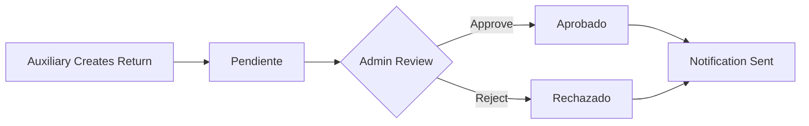

## Overview

The approval workflow ensures all product returns undergo administrative review before final processing. Admin users review pending returns, add authorization codes, and either approve or reject each submission with detailed observations.

<CardGroup cols={3}>
  <Card title="Pendiente" icon="clock">
    Awaiting admin review
  </Card>
  <Card title="Aprobado" icon="circle-check">
    Approved with authorization
  </Card>
  <Card title="Rechazado" icon="circle-xmark">
    Rejected with explanation
  </Card>
</CardGroup>

## Workflow States

Each return progresses through defined states:



### State Definitions

| State | Database Value | Description |
|-------|----------------|-------------|
| **Pending** | `Pendiente` | Return submitted by Auxiliary, awaiting admin review |
| **Approved** | `Aprobado` | Admin has approved the return with authorization code |
| **Rejected** | `Rechazado` | Admin has rejected the return with explanation |

## Admin Review Process

<Steps>
  <Step title="Access Admin Panel">
    Admin users (Grade 1) access the review queue at `index.php?url=admin/index`.
  </Step>
  
  <Step title="View Pending Returns">
    The system displays all returns with status `Pendiente` ordered by creation date (oldest first).
  </Step>
  
  <Step title="Review Details">
    Admin reviews:
    - Client information (NIT, name, address)
    - Product details (item code, description, quantities)
    - Evidence photograph (if uploaded)
    - Auxiliary user's observations
  </Step>
  
  <Step title="Make Decision">
    Admin chooses to approve or reject the return.
  </Step>
  
  <Step title="Add Authorization Code">
    For approvals, enter a unique authorization code.
  </Step>
  
  <Step title="Enter Observations">
    Provide detailed administrative notes explaining the decision.
  </Step>
  
  <Step title="Submit Review">
    The system updates the return status, records timestamp, and creates a notification.
  </Step>
</Steps>

## Implementation

### Admin Controller

The `AdminController` manages the approval interface:

```php controllers/AdminController.php
public function index() {
    $titulo = "Panel Administrador - DevolutionSync";
    
    // Obtener devoluciones pendientes
    $pendientes = $this->model->obtenerPendientes();
    
    // Obtener historial reciente (últimos 50 registros)
    $historial = $this->consultaModel->obtenerHistorial(50);
    
    // Cargar la vista
    require_once 'Views/admin/panel_administrador.php';
}
```

### Retrieving Pending Returns

The model fetches all pending returns chronologically:

```php models/DevolucionModel.php
public function obtenerPendientes() {
    // Busca todo lo que no esté revisado (Pendiente)
    $stmt = $this->db->prepare("SELECT * FROM devoluciones WHERE estado = 'Pendiente' ORDER BY fecha_creacion ASC");
    $stmt->execute();
    return $stmt->fetchAll(PDO::FETCH_ASSOC);
}
```

## Review Submission

### Processing Admin Decisions

The complete review logic with validation and transaction handling:

```php controllers/AdminController.php
public function revisar() {
    if ($_SERVER['REQUEST_METHOD'] === 'POST') {
        try {
            // Validar datos recibidos
            $id = intval($_POST['id_devolucion'] ?? 0);
            $accion = trim($_POST['accion'] ?? '');
            $codigo = trim($_POST['codigo_admin'] ?? '');
            $obs = trim($_POST['observacion_admin'] ?? '');
            $revisor = $_SESSION['user'] ?? $_SESSION['nombre'];
            
            // Validaciones
            if ($id <= 0) {
                throw new Exception('ID de devolución inválido');
            }
            
            if (!in_array($accion, ['aprobado', 'rechazado'])) {
                throw new Exception('Acción inválida. Debe ser "aprobado" o "rechazado"');
            }
            
            if (empty($codigo)) {
                throw new Exception('El código de autorización es obligatorio');
            }
            
            if (empty($obs)) {
                throw new Exception('Las observaciones son obligatorias');
            }
            
            // Procesar la revisión
            $resultado = $this->model->procesarRevision($id, $accion, $codigo, $obs, $revisor);
            
            if ($resultado) {
                // Intentar crear notificación (opcional, si existe el modelo)
                $this->crearNotificacion($id, $accion, $obs);
                
                // Redirigir con mensaje de éxito
                header('Location: index.php?url=admin/index&msg=success');
            } else {
                throw new Exception('Error al procesar la revisión en la base de datos');
            }
            
        } catch (Exception $e) {
            // Log del error
            error_log("Error en AdminController::revisar - " . $e->getMessage());
            
            // Redirigir con mensaje de error
            header('Location: index.php?url=admin/index&msg=error');
        }
        exit;
    }
}
```

<Note>
  All required fields are validated before processing. Missing or invalid data results in descriptive error messages.
</Note>

### Database Transaction

The model uses transactions to ensure data integrity:

```php models/DevolucionModel.php
public function procesarRevision($id, $accion, $codigo, $obs, $revisor) {
    try {
        $this->db->beginTransaction();

        // Actualizamos la devolución con la decisión del admin
        $sql = "UPDATE devoluciones 
                SET estado = ?, 
                    codigo_admin = ?, 
                    observacion_admin = ?, 
                    usuario_revisor = ?, 
                    fecha_revision = NOW() 
                WHERE id = ?";
        
        $stmt = $this->db->prepare($sql);
        $stmt->execute([$accion, $codigo, $obs, $revisor, $id]);

        $this->db->commit();
        return true;
    } catch (Exception $e) {
        $this->db->rollBack();
        return false;
    }
}
```

<Warning>
  The transaction ensures that if any part of the update fails, all changes are rolled back to maintain database consistency.
</Warning>

## Authorization Codes

Authorization codes provide audit trail and approval tracking:

<Tabs>
  <Tab title="Purpose">
    - Unique identifier for each approval
    - Links return to external authorization systems
    - Required for financial reconciliation
    - Audit trail for compliance
  </Tab>
  <Tab title="Format">
    The system accepts any alphanumeric code. Common formats:
    - `AUTH-20260305-001`
    - `DEV-2026-0123`
    - `APPR-AB123CD`
  </Tab>
  <Tab title="Storage">
    Codes are stored in the `codigo_admin` field of the `devoluciones` table.
  </Tab>
</Tabs>

## Notification System

The system can optionally notify users when their returns are reviewed:

```php controllers/AdminController.php
private function crearNotificacion($idDevolucion, $accion, $observacion) {
    try {
        // Verificar si existe el modelo de notificaciones
        if (!class_exists('NotificacionModel')) {
            return; // Si no existe, simplemente retornar
        }
        
        require_once 'Models/NotificacionModel.php';
        $notifModel = new NotificacionModel();
        
        // Obtener información de la devolución
        $devolucion = $this->consultaModel->obtenerPorId($idDevolucion);
        
        if ($devolucion && isset($devolucion['usuario_creador'])) {
            $estadoTexto = ($accion == 'aprobado') ? 'APROBADA ✅' : 'RECHAZADA ❌';
            $mensaje = "Tu devolución #{$idDevolucion} ha sido {$estadoTexto}. Observación: {$observacion}";
            
            $notifModel->crear([
                'id_devolucion' => $idDevolucion,
                'mensaje' => $mensaje,
                'usuario_destino' => $devolucion['usuario_creador'],
                'tipo' => $accion,
                'leida' => false
            ]);
        }
    } catch (Exception $e) {
        // Solo registrar el error, no detener el flujo
        error_log("Error al crear notificación: " . $e->getMessage());
    }
}
```

### Notification Table

Notifications are stored in the database:

```sql Script_BD/Script_DB.sql
CREATE TABLE IF NOT EXISTS notificaciones (
    id INT AUTO_INCREMENT PRIMARY KEY,
    id_devolucion INT NOT NULL,
    mensaje TEXT NOT NULL,
    leida BOOLEAN DEFAULT FALSE,
    fecha TIMESTAMP DEFAULT CURRENT_TIMESTAMP,
    usuario_destino VARCHAR(50) NOT NULL,
    FOREIGN KEY (id_devolucion) REFERENCES devoluciones(id)
);
```

## Access Control

Only Admin users (Grade 1) can access the approval panel:

```php controllers/AdminController.php
public function __construct() {
    if (session_status() === PHP_SESSION_NONE) session_start();
    
    // Verificar autenticación y permisos (Solo Grado 1 - Administrador)
    if (!isset($_SESSION['logged_in']) || $_SESSION['grado'] != 1) {
        header('Location: index.php?url=auth/index');
        exit;
    }
    
    $this->model = new DevolucionModel();
    $this->consultaModel = new ConsultaModel();
}
```

## State Transitions

<AccordionGroup>
  <Accordion title="Pendiente → Aprobado">
    **Trigger:** Admin submits approval form with valid authorization code
    
    **Database Changes:**
    - `estado` = 'aprobado'
    - `codigo_admin` = authorization code
    - `observacion_admin` = admin notes
    - `usuario_revisor` = admin username
    - `fecha_revision` = current timestamp
    
    **Side Effects:**
    - Notification created for auxiliary user
    - Return enters approved reports
  </Accordion>
  
  <Accordion title="Pendiente → Rechazado">
    **Trigger:** Admin submits rejection form with explanation
    
    **Database Changes:**
    - `estado` = 'rechazado'
    - `codigo_admin` = rejection reference
    - `observacion_admin` = rejection reason
    - `usuario_revisor` = admin username
    - `fecha_revision` = current timestamp
    
    **Side Effects:**
    - Notification created for auxiliary user
    - Return excluded from approval statistics
  </Accordion>
</AccordionGroup>

## Review History

The admin panel displays recent review activity:

```php controllers/AdminController.php
// Obtener historial reciente (últimos 50 registros)
$historial = $this->consultaModel->obtenerHistorial(50);
```

This provides admins with context about recent decisions and patterns.

## Best Practices

<CardGroup cols={2}>
  <Card title="Authorization Codes" icon="hashtag">
    Use consistent, descriptive codes that link to external tracking systems.
  </Card>
  <Card title="Detailed Observations" icon="comment-dots">
    Provide clear explanations for all decisions to help auxiliary users understand rejections.
  </Card>
  <Card title="Review Promptly" icon="clock">
    Process pending returns in chronological order to minimize client wait times.
  </Card>
  <Card title="Evidence Review" icon="image">
    Always check uploaded photographs before making approval decisions.
  </Card>
</CardGroup>

## Next Steps

<CardGroup cols={2}>
  <Card title="Dashboard Analytics" icon="chart-line" href="/features/dashboard-analytics">
    View approval statistics and performance metrics
  </Card>
  <Card title="Return Management" icon="box-open" href="/features/return-management">
    Learn how returns are initially registered
  </Card>
</CardGroup>